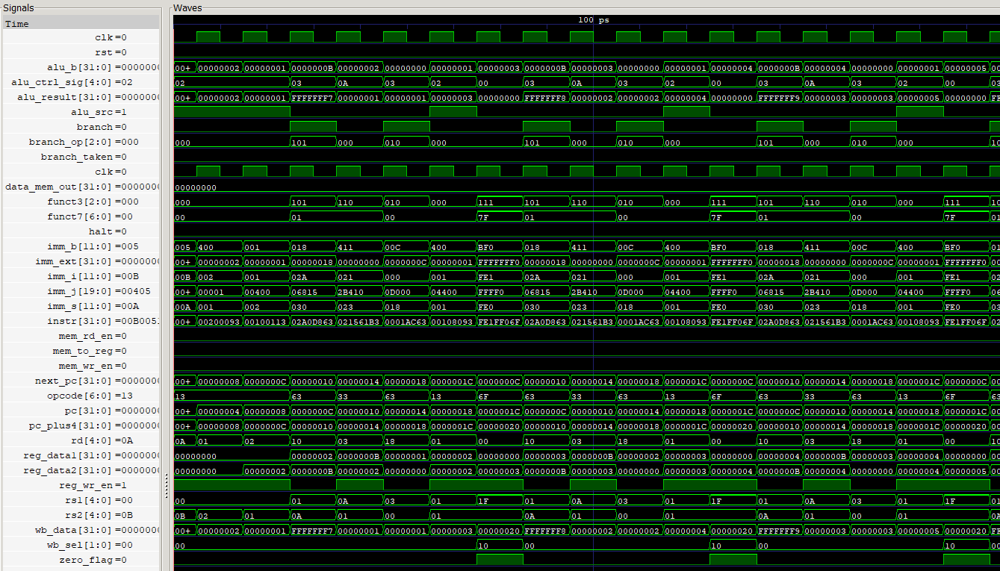
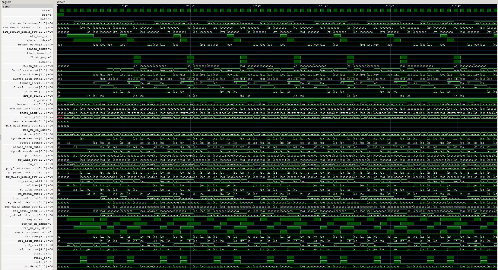

# RTL Design Challenges & RISC-V CPUs (Single-Cycle + Pipelined)

This repository documents my hands-on learning journey through **RTL (Register Transfer Level) design**, featuring a complete **RISC-V RV32IM CPU**, foundational logic exercises, and an expanding pipelined implementation. All projects are written in **SystemVerilog**, with simulation powered by **ModelSim** and waveform inspection using **GTKWave**. It also includes a **Python-based assembler** that translates assembly instructions into machine code for simulation.


## Project Breakdown

### RTL Challenges (Weeks 1–3)

Directory: `RTL_Challenges/`

Three weeks of incremental RTL modules, each with a dedicated testbench and waveform validation:

- **Combinational Logic**: Muxes, decoders, ALUs, counters, LFSRs
- **Sequential Logic**: DFFs, shift registers, reloading counters
- **FSMs**: Sequence detectors, gray code converters
- **Arbiters**: Fixed-priority and round-robin
- **Bus Protocols**: APB master-slave, FIFO, and memory interface
- **SoC-Style Integration**: `apb_system` test with full bus arbitration and memory access

---

### RISC-V Single-Cycle CPU (`RV32IM`)
<p align="center">
  <br/>
  <em>Waveform of Prime Checker</em>
</p>

Directory: `risc-v/`

A modular 32-bit RISC-V processor built from scratch in SystemVerilog:

- **Instruction Set Support**:
  - **RV32I Base**: `add`, `sub`, `addi`, `and`, `or`, `slt`, `sw`, `lw`, `jal`, `jalr`, `beq`, `bne`, `bge`.
  - **M-Extension**: `mul`, `mulh`, `mulhu`, `mulhsu`, `div`, `divu`, `rem`, `remu`
- **Modular Pipeline Stages**: Fetch, Decode, Execute, Memory, Writeback, Control Unit
- **Python Assembler**: `riscv_assembler.py` converts assembly instructions to machine code
- **Validation**: Testbench loads `.hex` or `.bit` programs and monitors state transitions

#### Sample Program: Prime Number Checker
Validates control flow (`bge`, `rem`, `bne`) and arithmetic correctness.

---

### RISC-V Pipelined CPU (`RV32IM`)
<p align="center">
  <br/>
  <em>Waveform of Prime Checker</em>
</p>

Directory: `riscv_pipelined/`

A fully working **5-stage pipelined 32-bit RISC-V CPU**, built in SystemVerilog. This design improves performance over the single-cycle version by introducing instruction-level parallelism and resolving common data/control hazards.

- **Classic 5-Stage Pipeline**:
  - **IF**: Program counter, instruction memory, and prefetch buffer  
  - **ID**: Register file, decoder, and immediate extractor  
  - **EX**: ALU and ALU control logic  
  - **MEM**: Data memory access  
  - **WB**: Writeback multiplexer  

- **Hazard and Forwarding Logic**:
  - Automatic stalling on load-use hazards  
  - Forwarding paths from MEM and WB stages to EX inputs  
  - Branch and jump flush logic with PC redirection  

- **Control & Timing**:
  - Control unit generates all stage signals  
  - Pipeline registers (`if_id`, `id_ex`, `ex_mem`, `mem_wb`) preserve data across cycles  
  - Full support for **RV32I** and **M-extension** instructions  

- **Testbench Support**:
  - Loads `.hex` or `.bit` programs  
  - Validates register/memory state after execution  
  - Supports waveform dumping via VCD for GTKWave visualization  

> Verified with the Prime Checker program and additional test cases. Executes smoothly with proper forwarding, stalling, and flushing.

---

**Repository Structure**

<!-- <details>
<summary><strong>Click to expand</strong></summary> -->

```
├── RTL_Challenges/
│   ├── week_1/
│   │   │── 01-mux/
│   │   │    │── mux_2-1.sv
│   │   │    └── tb_mux.sv
│   │   │ 
│   │   │── 02-d-ff-async/
│   │   │    │── d_ff_async.sv
│   │   │    └── tb_d_ff_async.sv
│   │   │ 
│   │   │── 03-edge_detector/
│   │   │    └── edge_detector.sv
│   │   │ 
│   │   │── 04-alu/
│   │   │    │── alu.sv
│   │   │    └── tb_alu.sv
│   │   │ 
│   │   │── 05-odd_counter/
│   │   │    │── alu.sv
│   │   │    └── tb_alu.sv
│   │   │ 
│   │   │── 06-shift_register/
│   │   │    │── shift_register.sv
│   │   │    └── tb_shift_register.sv
│   │   │ 
│   │   │── 07-lfsr/
│   │   │    │── lfsr.sv
│   │   │    └── tb_lfsr.sv
│   │   │ 
│   ├── week_2/
│   │   │── 01-binary_one-hot-converter/
│   │   │    └── binary_one-hot-converter.sv
│   │   │ 
│   │   │── 02-binary2graycode/
│   │   │    └── binary2graycode.sv
│   │   │ 
│   │   │── 03-reloading_counter/
│   │   │    └── reloading_counter.sv
│   │   │ 
│   │   │── 04-parallel2serial_shifter/
│   │   │    │── parallel2serial_shifter.sv
│   │   │    └── tb_parallel2serial_shifter.sv
│   │   │ 
│   │   │── 05-sequence_detector_fsm/
│   │   │    │── sequence_detector_fsm.sv
│   │   │    └── tb_sequence_detector_fsm.sv
│   │   │ 
│   │   │── 06-ways_to_implement_muxes/
│   │   │    │── muxes.sv
│   │   │    └── tb_muxes.sv
│   │   │ 
│   │   │── 07-fixed_priority_arbiter/
│   │   │    │── fixed_priority_arbiter.sv
│   │   │    └── tb_fixed_priority_arbiter.sv
│   │   │ 
│   ├── week_3/
│   │   │── 01-round_robin_arbiter/
│   │   │    │── round_robin_arbiter.sv
│   │   │    └── tb_round_robin_arbiter.sv
│   │   │ 
│   │   │── 02-apb_master/
│   │   │    └── 02-apb_master.sv
│   │   │ 
│   │   │── 03-memory_interface/
│   │   │    │── memory_interface.sv
│   │   │    └── tb_memory_interface.sv
│   │   │ 
│   │   │── 04-apb_slave/
│   │   │    └── 04-apb_slave.sv
│   │   │ 
│   │   │── 05-fifo/
│   │   │    │── fifo.sv
│   │   │    └── tb_fifo.sv
│   │   │ 
│   │   └── 06-apb_system/
│   │        │── a01_defines_pkg.sv
│   │        │── a02_arbiter.sv
│   │        │── a03_fifo.sv
│   │        │── a04_apb_master.sv
│   │        │── a05_apb_slave.sv
│   │        │── a06_top_system.sv
│   │        └── tb_top_system.sv
│   │     
│   │── risc-v/
│   |    │── 01-fetch/
│   |    │    │── instr_mem.sv
│   |    │    └── pc_register.sv
|   |    |
│   |    │── 02-decode/
│   |    │    │── decoder.sv
│   |    │    └── regfile.sv
|   |    |
│   |    │── 03-execute/
│   │    │    │── alu_ctrl.sv
│   │    │    └── alu.sv
|   │    |
│   │    │── 04-memory/
│   │    │    └── data_mem.sv
|   │    |
│   │    │── 05-writeback/
│   │    │    └── writeback_mux.sv
|   │    |
│   │    │── 06-control_unit/
|   │    |    └── control_unit.sv
|   │    |
|   │    ├── all_pkgs.sv
|   │    ├── cpu_single_cycle.sv
|   │    ├── tb_cpu.sv
|   │    ├── riscv_assembler.py
|   │    ├── waveform.png
|   │    └── instructions.bit
│   │     
│   └── riscv_pipelined/
|   |    │── 1-fetch/
│   |    │    │── instr_mem.sv
│   |    │    └── pc_register.sv
│   |    │
|   |    │── 1.5-if-id/
│   |    │    │── instr_mem.sv
│   |    │    └── pc_register.sv
|   |    |
│   |    │── 2-decode/
│   |    │    │── decoder.sv
│   |    │    └── regfile.sv
│   |    │
|   |    │── 2.5-id-ex/
│   |    │    │── instr_mem.sv
│   |    │    └── pc_register.sv
│   │    │ 
│   |    │── 3-execute
│   │    │    │── alu_ctrl.sv
│   │    │    └── alu.sv
|   │    |
|   |    │── 3.5-ex-mem/
│   |    │    │── instr_mem.sv
│   |    │    └── pc_register.sv
|   │    |
│   │    │── 4-memory/
│   │    │    └── data_mem.sv
|   │    |
|   |    │── 4.5-mem-wb/
│   |    │    │── instr_mem.sv
│   |    │    └── pc_register.sv
|   │    |
│   │    │── 5-writeback/
│   │    │    └── writeback_mux.sv
|   │    |
│   │    │── 6-control_unit/
|   │    |    └── control_unit.sv
|   │    |
|   │    ├── all_pkgs.sv
|   │    ├── cpu_pipeline.sv
|   │    ├── forwarding_unit.sv
|   │    ├── hazard_unit.sv
|   │    ├── tb_cpu.sv
|   │    ├── riscv_assembler.py
|   │    ├── waveform-pipelined.png
|   │    └── instructions.bit
├── run.bat
└── README.md
```

## 


### Note:

To run testbenches:  
    Using ModelSim: Run in terminal from main directory (RTL100Challenge) `./run ./<folder containing the design.sv and tb_design.sv>` 

<!--
- To preview: Ctrl+Shift+V
- To convert to pdf: F1 -> write "export" -> choose pdf
- To run waveguide simulation run in terminal: gtkwave.exe .\dump.vcd
--->
